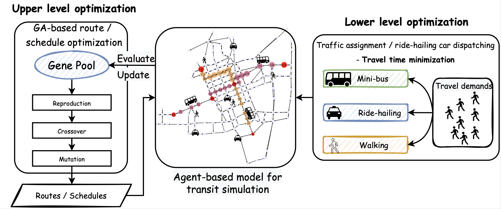
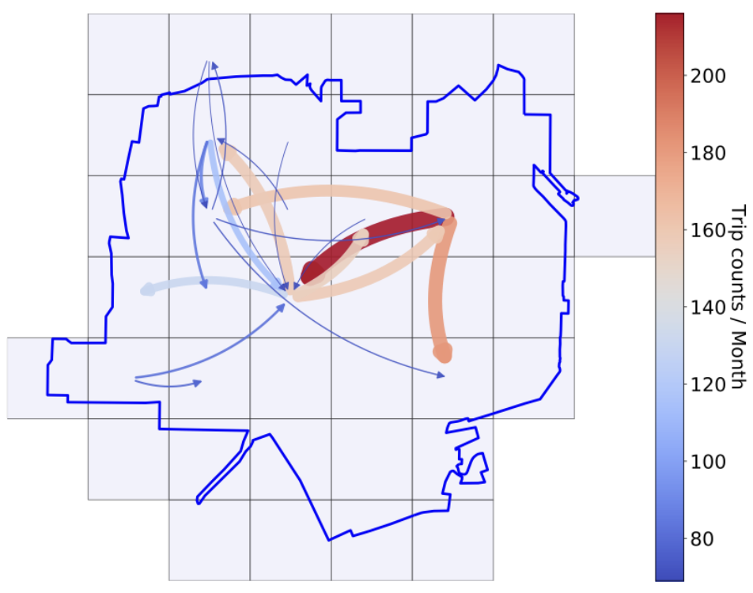
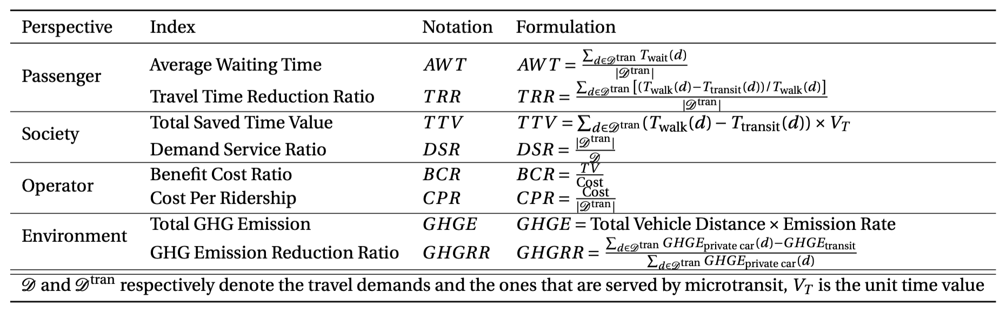

# AMOID: <u>A</u>utomated <u>M</u>icrotransit <u>O</u>ptimization Model Powered by <u>I</u>ndividual Travel <u>D</u>ata
AMOID is a GA and ABM based microtransit design model that collaboratively optimize bus routing, scheduling and ride-hailing car dispatching.

> Author: Jinming Yang

## Model Framework

## Data Sample

- [Tampa Travel Demands in November, 2019](https://github.com/Vadermit/AMOID/blob/main/data/tampa_data_sample.csv)

  - This is a tab separated list of [ride_id,rider_id,date,wait_time_minutes,pickup_time,dropoff_time,pickup_lat,pickup_lon,dropoff_lat,dropoff_lon,passengers,combo_id,vehicle_type,vehicle_max_pax]

  

## Quick Test

- [Test AMOID in Tampa](https://github.com/Vadermit/AMOID/blob/main/AMOID_in_Tampa.ipynb)

## Evaluation Indices

